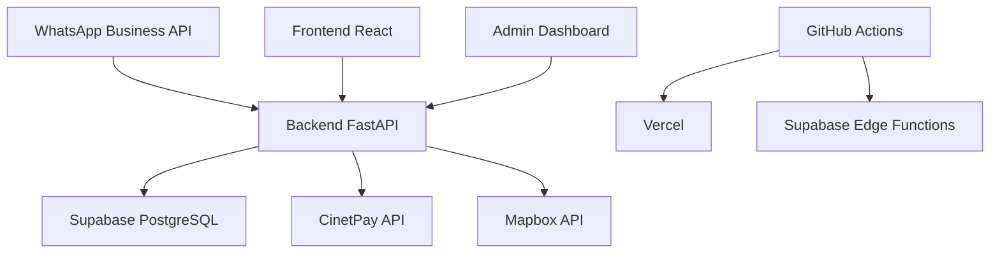

# 🍽️ ChopExpress - Bot WhatsApp pour Commandes & Livraisons

**Bot intelligent de commande et livraison de repas via WhatsApp pour le Cameroun**

[](https://github.com/ngoumtsaromuald/chopexpress/actions)
[](https://api.chopexpress.com/health)
[](https://chopexpress.com)
[](LICENSE)

## 🎯 Vision du Projet

ChopExpress révolutionne l'expérience de commande de repas au Cameroun en utilisant WhatsApp, l'application de messagerie la plus populaire. Notre bot intelligent permet aux clients de commander facilement leurs plats préférés tout en offrant aux restaurants des outils puissants de gestion.

## ✨ Fonctionnalités Principales

### 👥 Pour les Clients
- 🗨️ **Commande 100% conversationnelle** via WhatsApp
- 📍 **Géolocalisation** pour trouver les restaurants proches
- 🍽️ **Menu interactif** avec images et descriptions
- 🛒 **Panier personnalisable** avec notes spéciales
- 💳 **Paiement sécurisé** via CinetPay
- 📱 **Suivi en temps réel** de la livraison
- ⭐ **Historique et évaluations** des commandes

### 🏪 Pour les Restaurants
- 📋 **Réception automatique** des commandes
- 🔄 **Gestion des statuts** en temps réel
- 📊 **Contrôle dynamique** du menu et des stocks
- 💬 **Messagerie intégrée** avec les clients
- 📈 **Analytics** et rapports de performance

### 👨‍💼 Pour les Administrateurs
- 🎛️ **Tableau de bord global** avec KPIs
- 💰 **Gestion des paiements** et remboursements
- 🛡️ **Modération** des restaurants et avis
- 🎧 **Support client** intégré

## 🏗️ Architecture Technique



### 🛠️ Stack Technologique

**Backend**
- 🐍 **FastAPI** - API REST haute performance
- 🗄️ **Supabase** - Base de données PostgreSQL managée
- 🔐 **JWT** - Authentification sécurisée
- 📱 **WhatsApp Business API** - Intégration messagerie
- 💳 **CinetPay** - Passerelle de paiement
- 🗺️ **Mapbox** - Géolocalisation et cartes

**Frontend**
- ⚛️ **React 18** + **TypeScript**
- 🎨 **TailwindCSS** + **Radix UI**
- 🌐 **React i18next** - Internationalisation
- 📊 **TanStack Query** - Gestion d'état serveur
- 🗺️ **React Map GL** - Cartes interactives
- 📈 **Recharts** - Visualisations de données

**DevOps & CI/CD**
- 🚀 **GitHub Actions** - Pipeline automatisé
- ☁️ **Vercel** - Déploiement frontend
- 🔧 **Supabase Edge Functions** - Backend serverless
- 🧪 **Pytest** + **Vitest** - Tests automatisés
- 📊 **Codecov** - Couverture de code

## 🚀 Démarrage Rapide

### 📋 Prérequis

- **Node.js** 18+ et **npm** 9+
- **Python** 3.11+ et **pip**
- **Git** pour le versioning
- **Compte Supabase** (gratuit)
- **Compte WhatsApp Business** (optionnel pour dev)

### 🔧 Installation

1. **Cloner le repository**
```bash
git clone https://github.com/ngoumtsaromuald/chopexpress.git
cd chopexpress
```

2. **Configuration Backend**
```bash
cd backend

# Créer un environnement virtuel
python -m venv venv
source venv/bin/activate  # Linux/Mac
# ou
venv\Scripts\activate     # Windows

# Installer les dépendances
pip install -r requirements.txt

# Configurer les variables d'environnement
cp .env.example .env
# Éditer .env avec vos clés API
```

3. **Configuration Frontend**
```bash
cd ../frontend

# Installer les dépendances
npm install

# Configurer les variables d'environnement
cp .env.example .env.local
# Éditer .env.local avec vos configurations
```

### 🏃‍♂️ Lancement en Développement

**Terminal 1 - Backend**
```bash
cd backend
python main.py
# 🚀 API disponible sur http://localhost:8000
# 📚 Documentation sur http://localhost:8000/docs
```

**Terminal 2 - Frontend**
```bash
cd frontend
npm run dev
# 🌐 Interface sur http://localhost:3000
```

### 🔗 Configuration Webhook WhatsApp (Développement)

1. **Installer ngrok** (pour exposer localhost)
```bash
# Via npm
npm install -g ngrok

# Ou télécharger depuis https://ngrok.com/
```

2. **Exposer le webhook**
```bash
ngrok http 8000
# Copier l'URL HTTPS générée (ex: https://abc123.ngrok.io)
```

3. **Configurer WhatsApp Business**
- URL du webhook: `https://abc123.ngrok.io/webhook`
- Token de vérification: `chopexpress_verify_token`

### ✅ Vérification de l'Installation

**Test Backend**
```bash
curl http://localhost:8000/health
# Réponse attendue: {"status": "healthy", ...}
```

**Test Webhook**
```bash
curl "http://localhost:8000/webhook?hub.mode=subscribe&hub.verify_token=chopexpress_verify_token&hub.challenge=test123"
# Réponse attendue: 123
```

**Test Frontend**
- Ouvrir http://localhost:3000/menu
- Vérifier que la page "Menu" s'affiche
- Tester le changement de langue (FR/EN)

## 🧪 Tests

### Backend
```bash
cd backend
pytest --cov=. --cov-report=html
# Rapport de couverture dans htmlcov/index.html
```

### Frontend
```bash
cd frontend
npm run test:coverage
# Rapport de couverture dans coverage/index.html
```

### Tests d'Intégration
```bash
# Lancer le pipeline complet
npm run test:integration
```

## 📦 Déploiement

### 🔄 Déploiement Automatique

Le déploiement est automatisé via GitHub Actions :

- **Push sur `develop`** → Déploiement staging
- **Push sur `main`** → Déploiement production

### 🎯 Environnements

| Environnement | Frontend | Backend | Base de données |
|---------------|----------|---------|----------------|
| **Développement** | localhost:3000 | localhost:8000 | Local/Supabase |
| **Staging** | staging.chopexpress.com | staging-api.chopexpress.com | Supabase Staging |
| **Production** | chopexpress.com | api.chopexpress.com | Supabase Production |

## 🌍 Internationalisation

ChopExpress supporte le **français** et l'**anglais** avec des terminologies spécifiques au Cameroun :

- 🇫🇷 **Français** - Langue par défaut
- 🇬🇧 **English** - Support complet
- 💰 **Devise** - FCFA (Franc CFA)
- 📍 **Géolocalisation** - Adaptée au Cameroun

## 📊 Monitoring & Analytics

- 📈 **Métriques temps réel** via Supabase Analytics
- 🚨 **Alertes automatiques** pour les erreurs critiques
- 📊 **Dashboard admin** avec KPIs business
- 🔍 **Logs centralisés** pour le debugging

## 🤝 Contribution

1. **Fork** le projet
2. **Créer** une branche feature (`git checkout -b feature/amazing-feature`)
3. **Commit** les changements (`git commit -m 'Add amazing feature'`)
4. **Push** vers la branche (`git push origin feature/amazing-feature`)
5. **Ouvrir** une Pull Request

### 📝 Standards de Code

- **Backend** : Black, Flake8, isort, MyPy
- **Frontend** : ESLint, Prettier, TypeScript strict
- **Tests** : Couverture minimum 80%
- **Documentation** : Docstrings et commentaires en français

## 📄 Licence

Ce projet est sous licence MIT. Voir le fichier [LICENSE](LICENSE) pour plus de détails.

## 🆘 Support

- 📧 **Email** : support@chopexpress.com
- 💬 **Discord** : [Serveur ChopExpress](https://discord.gg/chopexpress)
- 📚 **Documentation** : [docs.chopexpress.com](https://docs.chopexpress.com)
- 🐛 **Issues** : [GitHub Issues](https://github.com/ngoumtsaromuald/chopexpress/issues)

## 🎉 Remerciements

- 🙏 **Communauté Open Source** pour les outils exceptionnels
- 🇨🇲 **Développeurs camerounais** pour l'inspiration locale
- 🍽️ **Restaurants partenaires** pour leur confiance
- 👥 **Équipe ChopExpress** pour leur dévouement

---

<div align="center">
  <strong>Fait avec ❤️ au Cameroun pour révolutionner la livraison de repas</strong>
  <br>
  <sub>ChopExpress - Votre assistant WhatsApp pour des repas délicieux</sub>
</div>
